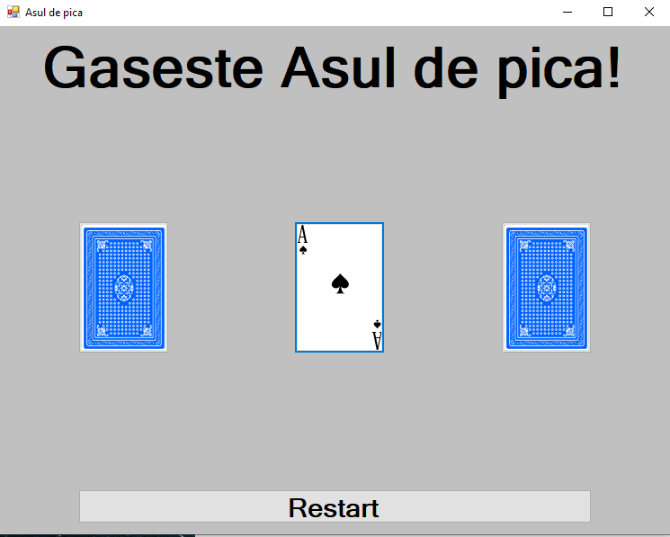

# AsulDePica
This project is one of my early C# projects. It recreates the game called in romanian "Alba-neagra" in which there are 3 cards swaped saveral times and the player must guess where the Ace is.

